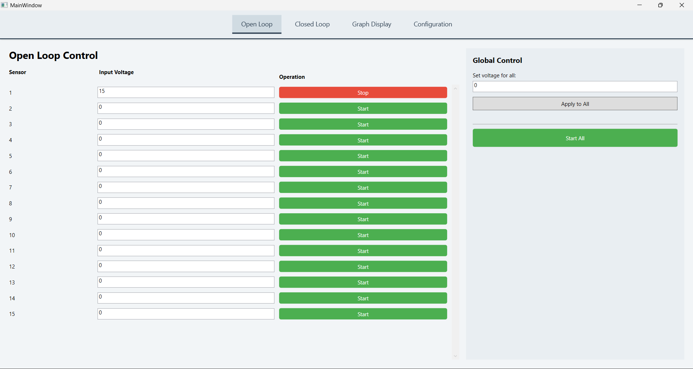
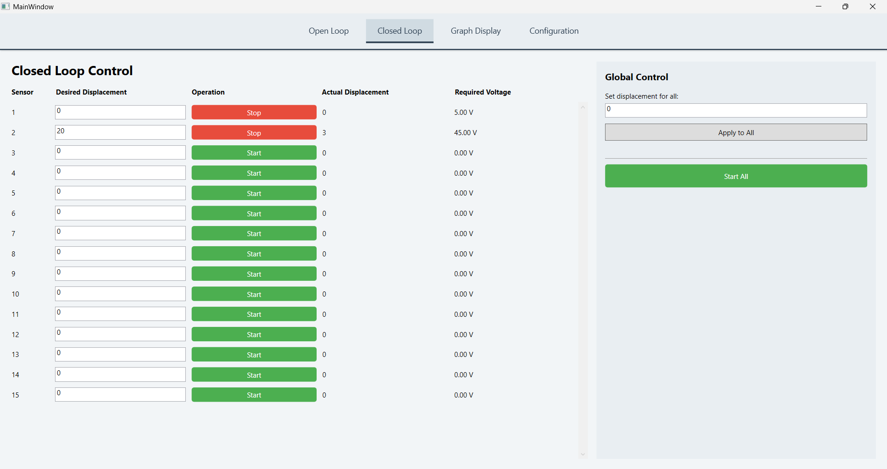
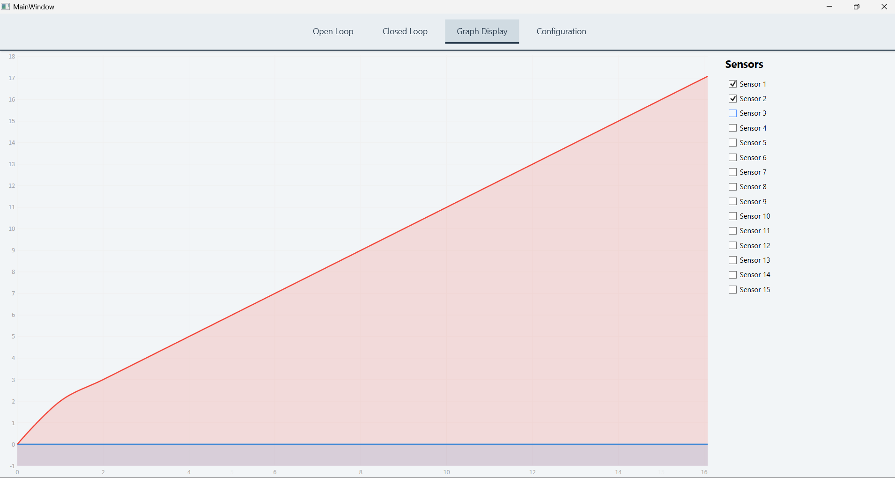
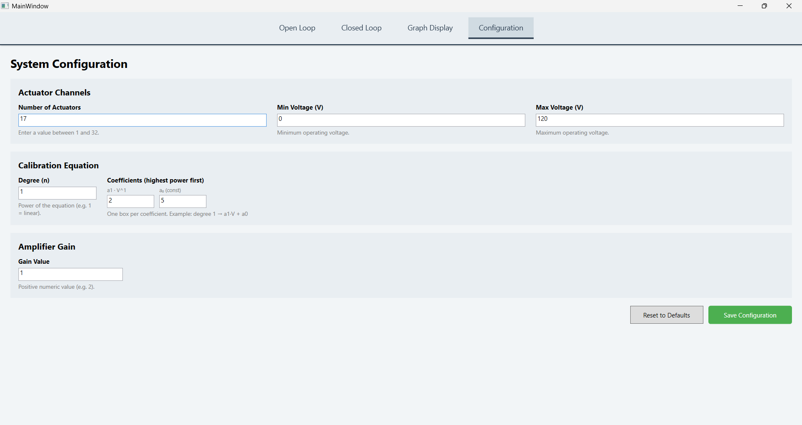

# SMA-Control-Software
# SMA Actuator Control System

## Overview

This application is a desktop-based control system for managing Shape Memory Alloy (SMA) actuators. It provides both open-loop and closed-loop control, along with graph visualization and user-defined configurations.

The system is designed to simulate actuator behavior and provide an intuitive interface for controlling and monitoring multiple actuators.

---

## Features

### 1. Open Loop Control

  

- User provides input voltage directly.
- The actuator runs based on the given voltage.
- User can:
  - Start / Stop operation anytime
  - Apply Set All to assign the same voltage to all actuators and can Start All at once

---

### 2. Closed Loop Control

  

- User provides desired displacement as input.
- The system computes the required voltage using the configured equation.
- Actuators run until the desired displacement is reached.

#### Important Constraint

- Open loop and closed loop cannot run simultaneously:
  - If open loop is running → closed loop is disabled
  - If closed loop is running → open loop is disabled

---

### 3. Graph Display

  

- Displays displacement vs time graphs for actuators.
- Only closed-loop data is visualized since there wont be feedback in open loop mode.
- Features:
  - Multiple actuator plotting
  - Individual sensor selection (show/hide) from right panel
  - updates during operation

---

### 4. Configuration

  

Users can define system parameters:

- Number of actuators
- Minimum and maximum voltage limits
- Polynomial equation (displacement → voltage mapping)
- Amplification gain

These configurations are used in closed-loop computation.

---

## Technologies Used

- C# (.NET WPF)
- LiveCharts (for graph visualization)

---

## Future Improvements

- Data persistence per user
- More graph controls

---

## Summary

This project demonstrates a complete actuator control workflow:

- Direct control (Open Loop)
- Feedback-based control (Closed Loop)
- Monitoring actuators (Graphs)
- Flexible system tuning (Configuration)

---
